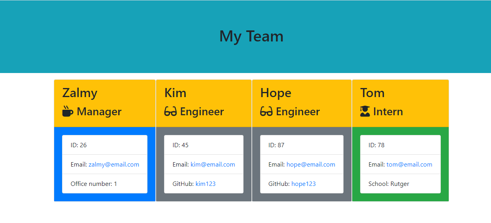
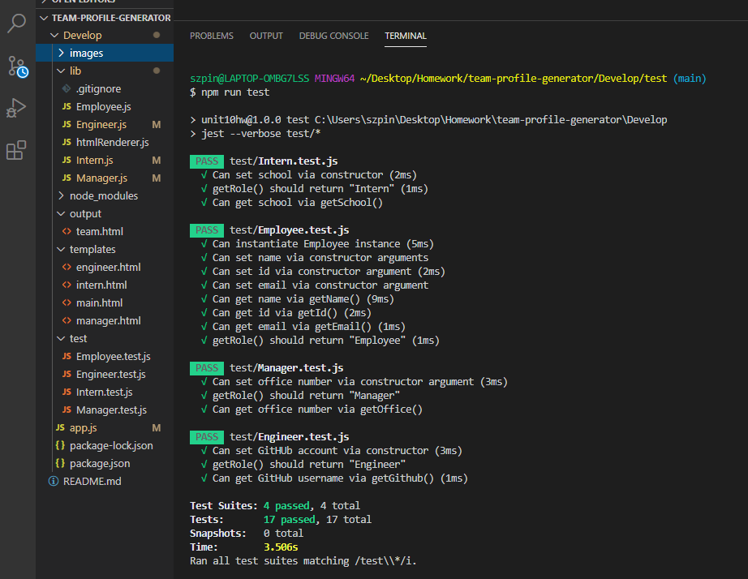

# team-profile-generator

## Project goal:

creating a app that creat card prifil for each ermployee with his basic info and display it nice on a web page.

## Instructions:

1. Enter 'node app' in the console to lanch the app.
2. Eter the information requiere for each employee.
3. after each employee creation, you have the choice to create a new one or to stop adding.
4. when you added all the aployees a HTML file is automaticly created with all the info.
5. when the HTML is opened in the browser it will display a nice card for each employee with all his info.

## Links:
GitHub Ripo:
https://github.com/zpinson/team-profile-generator

Live video:
https://drive.google.com/file/d/15diz9pV5f_VmB12hXTt2bPXQJcTgdPU0/view?usp=sharing

Live test:
https://drive.google.com/file/d/1ncLw3QTN2Obwt4H7UrUaeFYSRl7uHi6u/view?usp=sharing

## Screenshots:

